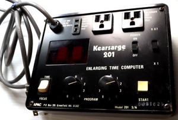
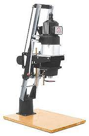
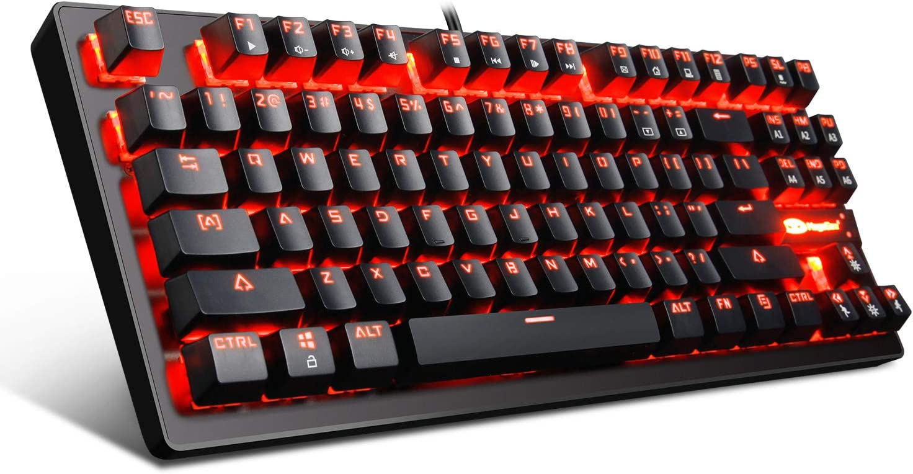
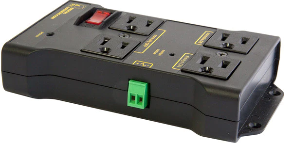
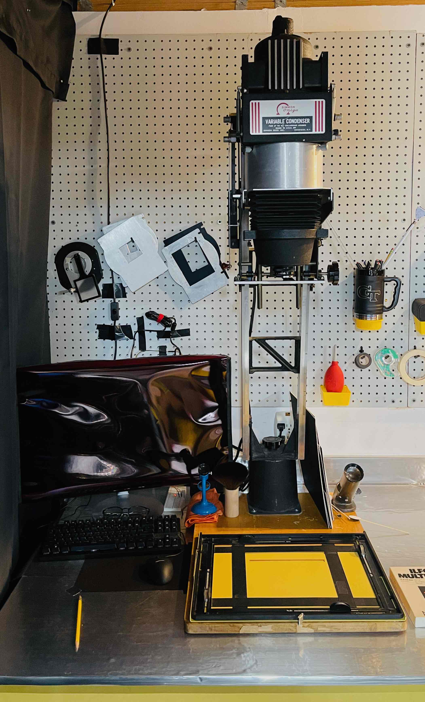
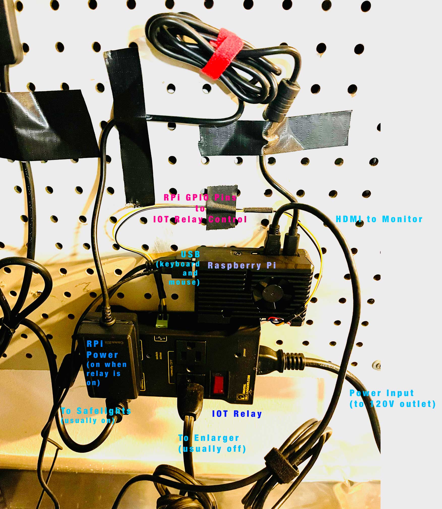

# smartdarkroom
Building the modern smart darkroom

## Motivation
As part of my photographic journey, I decided to get back into doing wet darkroom work.  I outfitted my home darkroom in the back of my garage, with equipment found from across eBay, Craigslist, and other resources. Part of that initial darkroom setup was a Kearsarge 201 Darkroom Timer.

It was a good timer until the day it died (at least one relay within the timer stopped working).  After having used that timer for a few months I was determined to find or make a modern solution for operating my enlarger (a simple Omega D-II).

Looking around the internet I found a few very expensive commercial solutions (new darkroom equipment in 2023 is very expensive), and a few homebrew darkroom timers.  The homebrew timers were largely open-sourced (many available here on GitHub), a few even did advanced f-stop timing, and they were all built around the notion of a closed and boxed-up timer, just like the Kearsarge.  I wanted something different, something that I  could use as a platform for controlling my entire darkroom, that provided user extensibility in ways not
yet imagined, and that gave capabilities not seen in other common solutions.

## User Interface
I started thinking about the user experience I wanted.  After considering being able to control the darkroom with a standard tablet or smartphone, which would bring lots of within-darkroom mobility to the eventual solution, I decided that had more challenges than I wanted to deal with: making a mobile device paper-safe, dealing with all too common Bluetooth or network failures, and it would require building a fixed and likely complicated user interface.

This is when I said 'Why not put a computer into the darkroom?'  I would get a standard user interface: monitor, keyboard, and mouse.  Having been a software developer at some point in my long past, I also knew that access to a command line and full programming environment provided the ultimate in extensibility.  There were still a few unknowns (e.g., could I make a monitor paper safe, was there a keyboard with red LEDs that was paper safe, etc.) but I felt more confident I could overcome those than with the mobile solution.

As for the user interface, I settled on the simplest thing I thought could work: a text-based command line and Python-based commands.  Python is a simple programming language to start on and provides lots of opportunities for a user to extend through additional programming.  Plus Python offered a built-in  [REPL](https://en.wikipedia.org/wiki/Read–eval–print_loop) that would allow unlimited interactivity, not just a fixed user interface.  Python gives you superpowers. So that was it, I would build a way to interact with the enlarger through a Python module.

## Hardware Base
Note: Any links in here are for convenience, none are affliate links.

For the computer there were many options available, and I choose to go with the [Raspberry Pi 4](https://www.raspberrypi.com/products/raspberry-pi-4-model-b/).  The Raspberry Pi 4 had all of the things I needed now and possibly in the future: runs a standard operating system, had ports for up to two monitors, lots of USB ports for controlling thing, good processor and lots of memory (I choose the 8GB version in case I needed in the future), and lots and lots of [general purpose input/output pins](https://projects.raspberrypi.org/en/projects/physical-computing/1) for all the things I might want to control or sense in the future (even if I only needed one pin now).  I placed this in a case to protect the RaspberryPi but give me easy access to all the ports and GPIO pins.

For the keyboard I looked for one that had controllable amounts of light and only used red LEDs, to hopefully be paper safe and never risk me switching to a non-paper safe color.  USB connectivity was the goal, to decrease the need to charge a keyboard or provide it batteries, and decrease the chance of keyboard-computer disconnect.  Found [this keyboard](https://a.co/d/675txB5) that met all the requirements.

I had bought an inexpensive mouse before for another project knew [this mouse](https://a.co/d/5Kkj89b) had a red LED only on it.  There are mice with what appears to be no LED glow, but I was unsure where they fell in the spectrum so decided to play it safe.

For a monitor, I had a spare LCD monitor.  I think just about any monitor could work, as long as there was a way to attach a paper-safe gel to the front of the monitor, and one could cover up any light coming from the back or sides of the monitor.  For the gel to cover the front of the monitor and make it paper-safe (just making the monitor red does not make it paper safe, the LCD does not effectively block non-paper-safe colors) I found a [LEE 27 gel](https://leefilters.com/colour/027-medium-red/) at my local camera store.  This gel was inexpensive and big enough to cover the monitor, and a quick test with my current paper showed it to be paper-safe.

At this point I had a computer, with easy to use interface and all the possible ways to interface to it I could imagine.  I needed something that would bridge from the computer to control the enlarger.  The Omega D-II enlarger is simple, it's just a tungsten bulb that can be turned on and off (there are cold light and dichromic heads for it, but I didn't have one of those).  There are plans available on the Internet to build your own, but then I am across the [IoT Relay by Digital Loggers](https://dlidirect.com/products/iot-power-relay).  This is a slick low cost device that looks like a standard power strip but with an included ability to control switching via external signal (and in this case exactly the level of signal the Raspberry Pi GPIO pins deliver).  One of the plugs is always on when the relay is on (perfect for powering the Raspberry Pi), two plugs are off when the signal is off (and vice-versa, perfect for turning on the enlarger bulb), and one plugs is on when the signal is off (and vice versa, perfect for a safelight that turns off when the enlarger is on).  There is optical isolation and it protects against surges.

## Hardware Installation
Here are a few photos of the hardware installed and integrated within my darkroom.  The first picture shows the enlarger, monitor, keyboard, and mouse configured.  The RaspberryPi and IoT relay are mounted to the wall behind the monitor.  And safelights are above and behind where I took the first picture from.  I made a 4 sided box out of mat board and used gaffers tape to attach the LEE 27 Gel.  This was slipped over the monitor and you see it here; in the dark it was confirmed no other light exited the monitor except through the gel.  A monochrome theme with dark background and white text (as well as other adjustments such as white outlines for windows) was applied to the graphical desktop of the Raspberry Pi to make it easier to see contrast through the filter.

This photo shows the RaspberryPi within its case and the IoT Relay mounted (using some two sided tape) to the wall behind the monitor.  The mounting to the wall was mostly to keep it out of the way and not for a functional reason.  The "always on" outlet of the IoT relay was used for the AC-DC converter for the power for the RaspberryPi.  A "usually off" outlet of the IoT relay had the enlarger plugged into it; and the "usually on" outlet of the relay has the nearby safelight plugged into it.  I choose to control the IoT relay from GPIO pin 18 of the RaspberryPi; the yellow wire between the RaspberryPi and relay is that control wire, and the black wire is a ground connection.  Additionally the keyboard and mouse are connected to the RaspberryPi USB outlets, and the monitor is connected to the first mini-HDMI port of the Raspberry Pi.

## smartdarkroom Python Module

TODO